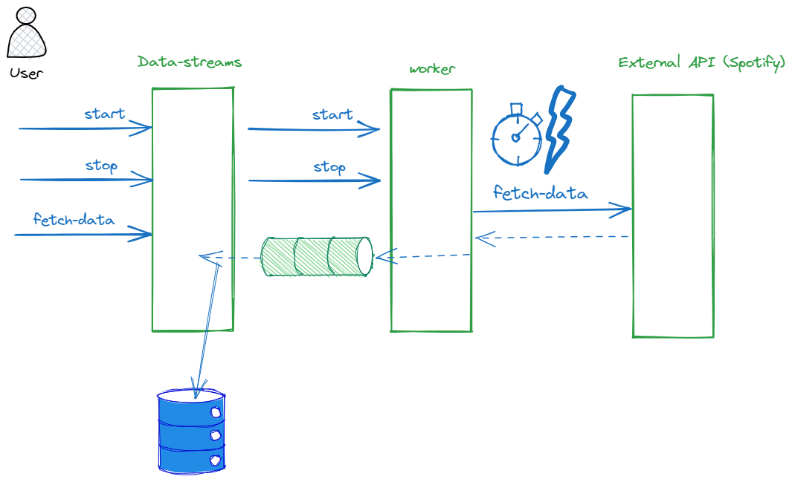

# Code Challenge Considerations

## 1.1 Get things up and running

    1) Fork Repository in github to own github account (cjjohansen)
    2) Clone Repository to own machine
    3) Run  yarn install to install all dependencies. (A few warnings but looks good enough)
    4) Run  yarn start to start data stream application.

    5) Run yarn start worker to start worker application  (Looks good enough)
 
  ## 1.2 Now I want to se tests running    

    1) I Take a look in package.json to see what commands are available. yarn test should dod the job.

> yarn test

    2) Tests looks green. 


 ## Other thoughts on the challenge


    1) Public API. Im uncertain if I am supposed to use som smart scripts to generate code. But for now I think I will just use public API as an index of API's. I could simply choose spotify's api to work with.
    2) The steps in the challenge could be solved one by one but alternave order could make sense as well.
    3) Solving it test driven is  agood way to make step by step progress. 


    
### Steps in challenge
- Configure a message protocol between the two services. You can get inspiration from the [nestjs docs.](https://docs.nestjs.com/microservices/basics) Choose which ever you want but tell us why in your answer.
- Create an endpoint on **data-streams** that tells **worker** to start fetching data on an interval (every 5 minutes).
- Setup an [http module](https://docs.nestjs.com/techniques/http-module) that **worker** can use to communicate with the external API.
- Send the data and store the results on **data-streams** using internal communication protocol.
- Make an endpoint on **data-streams** that can fetch the data stored on **data-streams**. Use whatever storage you see fit but tell us why you chose it.
- Make an endpoint on **data-streams** that can stop the data fetching on **worker**.


### Configuring a message protocol

REST, RPC, gRPC, GraphQL , async api. There are many to choose from. And what about plain http? isn't that a protocol allready? Well I interpret the link to nestjs microservices basic as a hint to use one of the protocols there.
Here I read the next confusing statement "In Nest, a microservice is fundamentally an application that uses a different transport layer than HTTP".

Nest supports different messaging patterns. Request / Response is one such example. And My question is now: Couldn't that be HTTP based? 

Anyway I Beleive my task is to choose messaging patterns and argure why.

The two servicese are 

data-streams and worker we have an external api as well.

I've made a small drawing that gives an overview.




The start and stop commands are command type communication that sends a command to the worker to start and stop working. We can make these synchronous request response types. So the worker can acknowledge that it has received the command.

For interchange of data we can set up a queue to receive data. This would be more recillient than returning big payloads of data. It would also solve the problem of providing a call back funtion from the workerservice to the data-streams service.

A thing to consider though is how data are fetched from the external api. Does that api support a streaming interface or do we use pagination or de we fetch a gigantic payload. (probably not the last) 

One thing to consider is how to let the data stream service know that it has received all data from the most resent fetch job. (Which runs every 5 minutes)
Maybe we would need versioning of the batches fetced. What I f a user calls the data-streams api to fetch data. What data should we return if we are in the middle of a batch job ? I't would be natural to fetch the most resent complete version.

### Day 2

I've managed to setup tests. I Ran into a problem with hanging resources in tests. 
I Tried adding tear down code to the afterEach function. That helped.
Alternative solution would be to allways executing start and stop in one test. Thats a pattern that actually works. can_start_and_stop_job(). Would let the test clean up after it self. 

```typescript
afterEach(() => {
    console.log(`After all`);
    const cronJobs = schedulerRegistry.getCronJobs();

    cronJobs.forEach((job, key) => {
      schedulerRegistry.deleteCronJob(key);
      console.log(`Deleted cron job: ${key}`);
    });
});

Agenda:

1) Add Real Call to external API. (Done)
2) Look at the middelware pattern. (We want to decorate the streaming of raw data with other functionality that could possibly be injected as middelware in our data pipeline).
3) Write more about my findings during solving of the code challenge. (Done)

```


### Day 3

Hmm this takes really much troubleshooting time for me.

 1) I've managaged to setup docker files and docker compose.
 2) Current problem is that I have connectivity issues with RabbitMQ. Some searching suggest that you need different queues for request and reply.
 
#### State of the solution

This solution reflects that this is my first time diving into nest JS, and a long time since I worked with a node JS backend. 

I've sacrificed some good practices like:

  1) to many console logs
  2) to big commits
  3) sleeps in tests.

#### Things I would normally consider

  1) As a developer I want an effective setup
  1.1) linting, hot reload, effective debugging with break points
  2) Configuration in our code should be handled in a clean and scalable way using .env files and domain specific strongly typed Configuration classes.
  3) Exeception handling is important. Consider global exception handler and injectable granular execption handlers that can be plugged in.
  4) Nest gives a good start for uisng composability by the use of modules and providers.
  5) One could imagine the use of middleware to incject different steps in a data pipeline.
  6) There are many differnt patterns for testing. e2e vs. unit testing. mocking versus testing the whole stack. How to make deterministic repeatable tests.
  7) Code often looks very technical becasue we use a lot of frameworks. Try to isolate Business related code, and try to organize and name things according to problem domain and business. What does the code achieve for its users. The code should communicate that.

  8) Messaging and error handlign is a big subject.  Production code should be able to handle various types of errors.
  8.1) Transient errors should be re tried
  8.2) User errors should be logged and alerted. USer might have doens something wrong. IS this a signal to improved validation. Dont alloe the user to do mistakes.
  8.3) Bugs in code should be logged

  So errorhandling means we need different kind of messages and error levels. Since different kinds of errors needs to be handled in different ways.


#### Things missing

I Still need to setup data storage and make a call that queries the data storage. IT Could be in memory.

I Need to make it all work.

Make it pretty.

Errorhandling

Other stuff as well :-)


